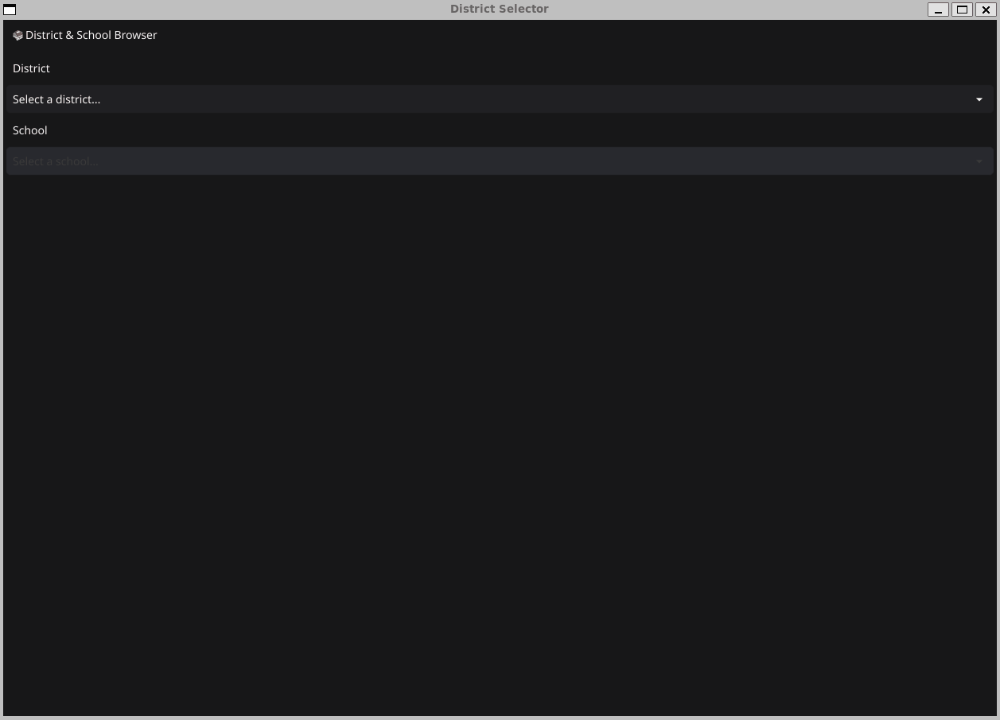

  # go-gui-dean

  

  ## Description

  A simple gui program that fetches info from a database and displays it.

  ## Table of Contents
  * [Installation](#installation)
  * [Usage](#usage)
  * [License](#license)
  * [Contribution](#contribution)
  * [Tests](#tests)
  * [Questions](#questions)
  
  ## Installation

  To install simply clone the repo and be sure to have a Go implementation installed.

  ## Usage

  To run the project ensure you have a Database connected and running and type go run cmd/app/main.go

  ## License

  This project uses the The MIT License.  
  Please visit [https://opensource.org/licenses/MIT](https://opensource.org/licenses/MIT) to learn more.
  

  ## Contribution

  No contributions please.
  
  ## Tests 

  No tests currently implemented.
  
  ## Questions
  Questions? Comments? Concerns? Feel free to reach out!  
  Email: bmkersey@gmail.com  
  GitHub: [bmkersey](https://github.com/bmkersey) 

  ## Demo
   
  
  